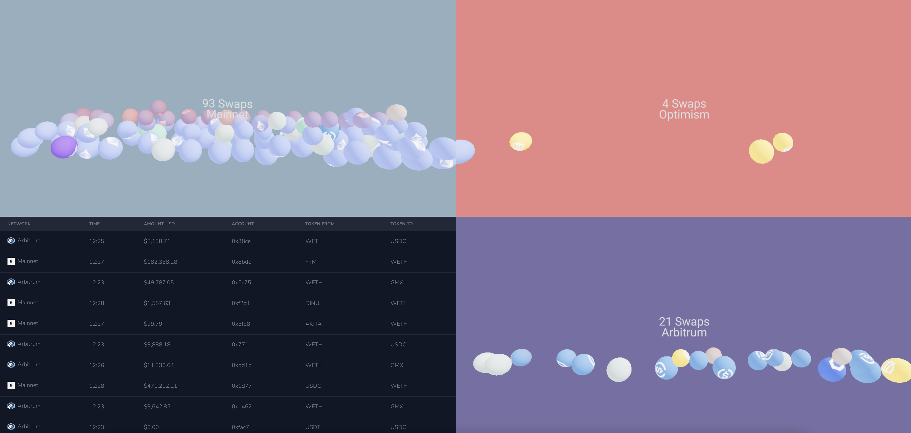

<!-- LOGO -->
 
<h1>

  
   Tx.Drip
</h1>

  <a href="#about-the-project">About The Project</a> •
  <a href="#stack">Stack</a> •
  <a href="#credits">Credits</a>

## About The Project
Tx.Drip is a 3D data visualization tool for tracking Uniswap transactions across Mainnet, Arbitum, and Optimism. Each swap is shown through a 3D sphere dropping onto a platform corresponding to the type and amount of swap occurring.

## Stack

Name                          |  Usage
----------------------------------|------------------------------------------------------------------------------------
Alchemy            |  Used as the provider for ENS resolution
The Graph            |  Provides on chain data for all data across the three services
ENS                |  Reverse and forward ENS resolution on transaction addresses.
Chakra UI                 |  For style

## Credits
- Created by Jack Burrus

